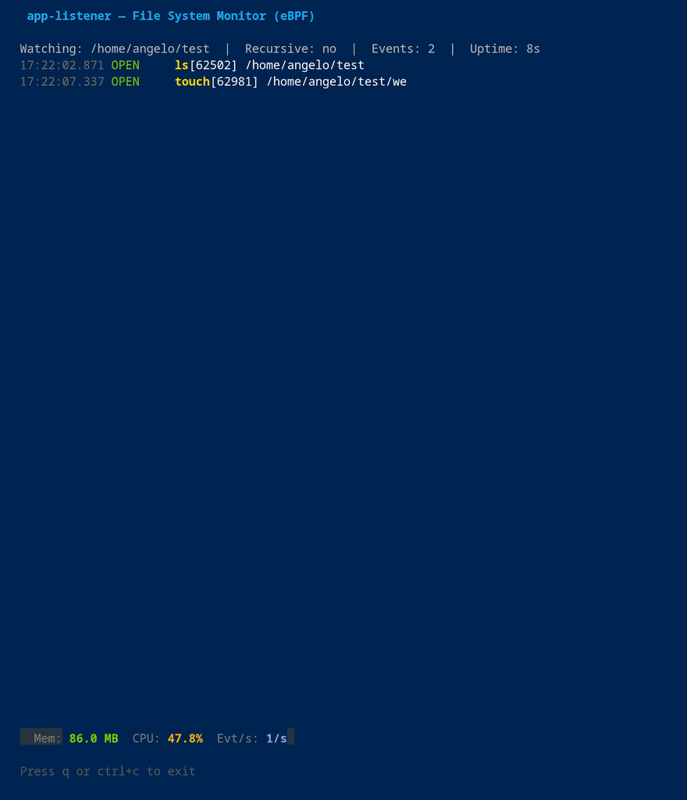
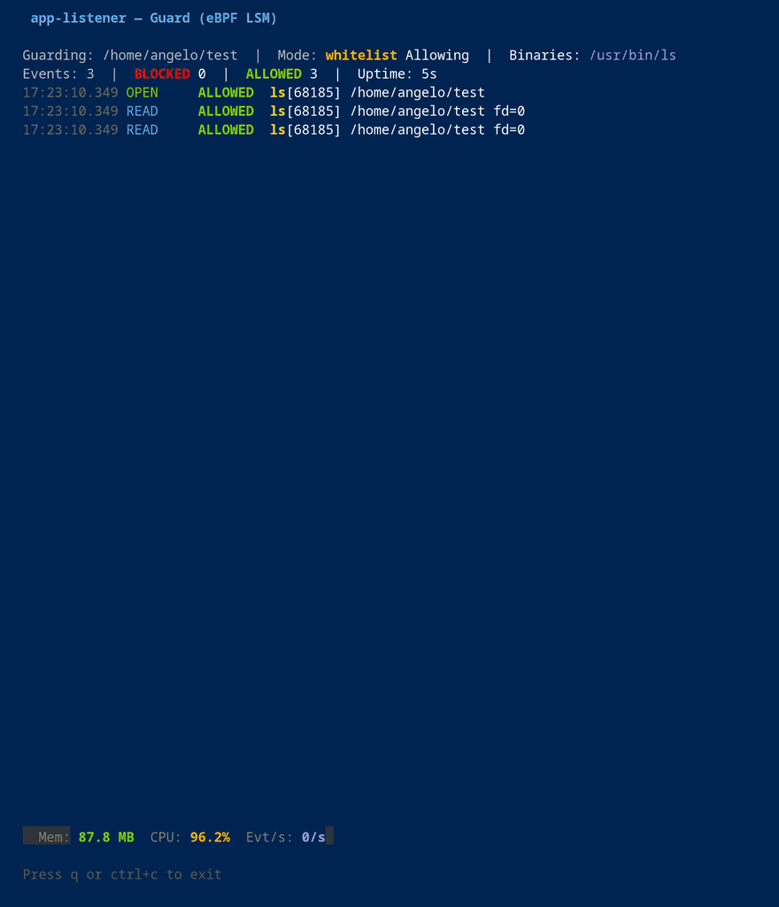

# app-listener

**Your secrets, readable only by the apps they belong to.**

On a Linux desktop, every program you run can read every file you own. Your SSH keys, browser
cookies, cloud credentials and AI tokens are open to any info-stealer that runs as you, and to
supply-chain malware: a poisoned `npm` or PyPI package, a backdoored dependency or a fake editor
extension runs inside tools you trust, and needs no root to take them. The same goes
for the coding agents now living in your terminal: Claude Code, Gemini CLI, opencode or Cursor run
commands with your permissions, and a prompt injection hidden in a README or a web page is enough
to send one of them reading `~/.aws/credentials` or another app's tokens.

app-listener lets you decide which programs may open which directories, and has the kernel
enforce it. `ssh` reads `~/.ssh`, Discord reads its own tokens, Claude Code reads its own config,
and nothing else gets in, even though everything runs as the same user:

```console
$ cat ~/.ssh/id_ed25519
cat: /home/alice/.ssh/id_ed25519: Operation not permitted
$ ssh -T git@github.com
Hi alice! You've successfully authenticated, but GitHub does not provide shell access.
```

> [!NOTE]
> A vibe-coding experiment, coded mainly with DeepSeek V4 Flash and Claude Code. Not for
> production systems.

## Quick install

```bash
curl -fsSL https://raw.githubusercontent.com/Virgula0/app-listener/main/scripts/install.sh | sudo bash
sudo app-listener install
```

The first command checks that your system is compatible, verifies the release signature and
installs the binary, without touching your files. **The second installs the protection daemon**: a
wizard lists the sensitive directories found on your system, encrypts the ones you pick, writes
their whitelists and enables a systemd service that guards them from boot. You need Linux 5.17 or
newer with BPF-LSM enabled; Arch Linux and Ubuntu 24.04 are fully supported (Ubuntu needs one
kernel boot parameter), on `x86_64` and `aarch64`. See [Compatibility](docs/compatibility.md) and
[Installation](docs/installation.md).

`sudo app-listener update` keeps it current, and `sudo app-listener uninstall` decrypts everything
and removes the service.

## Why it works

Regular Linux permissions only ask *which user* is opening a file. app-listener adds a mandatory
check that also asks *which program*, enforced through eBPF LSM hooks that sit behind every way of
reaching a file: plain opens, io_uring, hard links, renames, raw disk reads, `/proc` tricks. Each
protected directory gets its own whitelist, so applications are segregated from each other's data.
That is also what stops supply-chain malware: a poisoned package runs inside `node`, `python` or
your build tool, none of which is on the whitelist of your secrets, so whatever it smuggles in
reads nothing. You get the strength of mandatory access control with a policy as simple as a list
of directories and allowed programs: no AppArmor or SELinux profiles to write, and neither is
required.

Programs are recognized by the file they run from (its inode), so renaming a binary to `ssh` or
faking its process name gets it nothing. When the daemon is not running, protected directories are
encrypted with fscrypt, and they are unlocked only once the guard is in place. If the kernel can't
enforce, app-listener refuses to start rather than pretend. The test suite carries a [corpus of
bypass attempts](integrationtests/exploits/README.md) to prove the guards hold.

Setting it up is quick: one command installs the verified binary in seconds, and a wizard finds
the sensitive directories on your system (about 70 known locations: SSH, GnuPG, cloud CLIs, AI
agents, browsers, password managers, messaging apps, crypto wallets) and writes the policy for you.

## Modes

**`monitor`** shows every operation on a directory and the program behind it, without blocking
anything. It is the quickest way to learn what a new tool or package actually reads.

```bash
sudo app-listener monitor -w ~/.ssh
```



**`guard`** blocks access to a directory for every program except the ones you allow (or only the
ones you deny), for as long as it runs. Handy for a quick lockdown or for trying out a whitelist.

```bash
sudo app-listener guard ~/secret -w /usr/bin/cat
```



**`network-monitor`** and **`network-guard`** do the same for the network: see what a program
connects to, cut a single tool off, or let only your browser and the system's own services out. A
whitelisted program loses its access if someone injects code into it with `LD_PRELOAD` or a
planted library.

```bash
sudo app-listener network-monitor /usr/bin/curl
sudo app-listener network-guard -w /usr/lib/firefox/firefox --auto-infra
```

**`daemon`** is the mode most people want: permanent, encrypted protection of the directories you
choose, started at boot and kept in step with package upgrades and self-updating apps like Discord,
VS Code or Steam. You set it up with `sudo app-listener install`, and change protected files later
with `sudo app-listener edit-protected`.

## Limits

app-listener decides *which program* may read a file, not *why*. If the AWS CLI is allowed into
`~/.aws`, then any script can run `aws configure export-credentials` and get the keys printed,
because it is the AWS CLI reading them. Allow only the programs a directory really needs, and
never shells, interpreters or general tools like `git` or `cp`. It does not defend against an attacker who
already has root. See [Limitations](docs/limitations.md).

## Documentation

Every mode, flag and config option is documented in **[docs/](docs/README.md)**, starting from
[how it works](docs/how-it-works.md), the [daemon](docs/daemon.md) and
[troubleshooting](docs/troubleshooting.md).
